# 产品介绍

三两云智慧物业系统，是专为物业公司打造的一站式数字化管理平台。依托物联网、大数据与移动互联网技术，覆盖小区基础管理、业主服务、财务核算、设备运维、社区运营等全流程。通过自动化流程替代人工操作、数据看板辅助决策、多模块协同联动，帮助物业企业降低人力与运营成本，提升服务响应效率与业主满意度，实现从 “传统人工管理” 向 “数字化精准治理” 的转型。

# 体验地址 [https://abc.yimiyisu.com](https://abc.yimiyisu.com)

1. 用微信扫码系统二维码
2. 第一次体验，需要关注服务号
3. 自动进入系统

# 功能亮点
- 全流程数字化闭环：覆盖业主从入住到日常服务、费用缴纳的全生命周期，工单处理、巡检执行、费用催缴等核心流程线上闭环，减少纸质作业与沟通成本。
- 数据驱动精准管理：自动生成费用收缴率、巡检完成率等核心数据看板，直观呈现运营状态，实现科学决策。
- 物联网深度集成：无缝对接智能水电表、门禁、摄像头等设备，支持远程监控与数据自动采集，降低设备运维人力投入，提升园区安全管控能力。
- 多元收入生态构建：打通基础物业费收缴与社区电商、商业租赁等变现渠道，助力物业企业从 “单一收费” 转向 “多元盈利”。
- 高效业主服务响应：分类消息推送、在线工单处理、访客智能登记等功能，缩短服务响应时间，提升业主沟通效率与满意度。

# 核心功能
### 1.基础管理
- 小区与房屋管理：支持多区域、多楼栋、多单元的层级划分，精准维护房屋信息、户型结构、使用状态等基础数据。
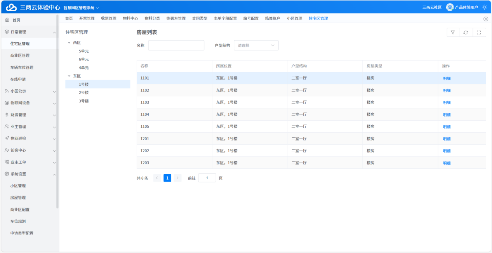
- 业主与住户管理：录入业主基础信息，处理住户添加申请，维护业主车辆、宠物等关联信息，支持筛选与状态管控。
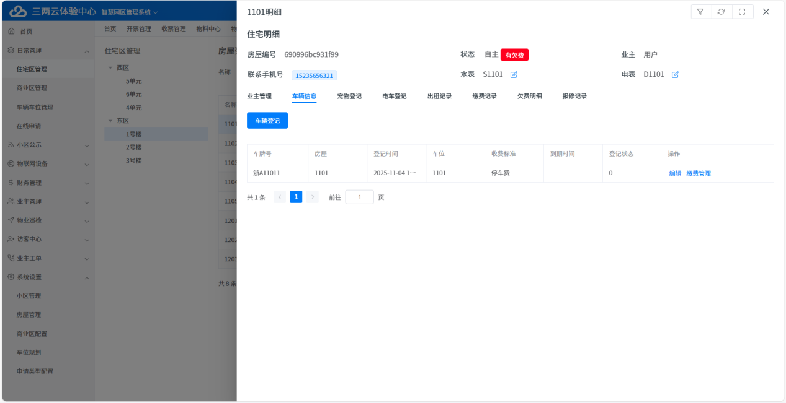
- 车位与车辆管理：规划固定/流动车位，登记车辆信息并关联房屋与车位，设置收费标准，实现车辆进出与缴费的一体化管理。
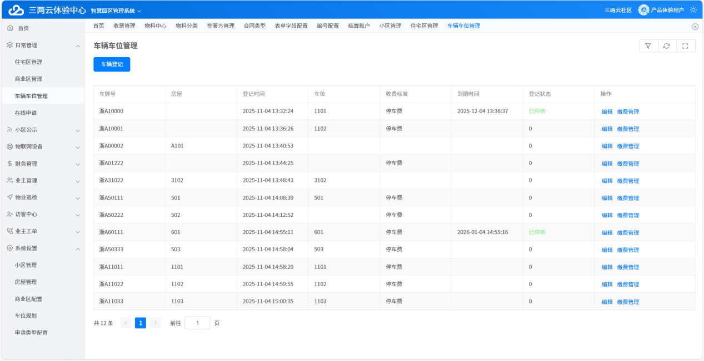

### 2.运营服务
- 工单闭环处理：接收业主报修、投诉等申请，实现派单、处理、反馈全流程跟踪，支持加急标记与进度查询。
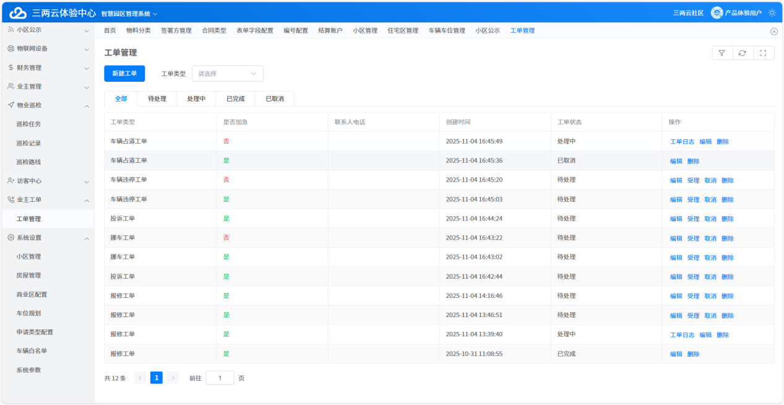
- 物业巡检管理：自定义巡检路线与周期，创建安全巡检、设施巡检等任务，实时记录巡检结果，异常情况快速上报。

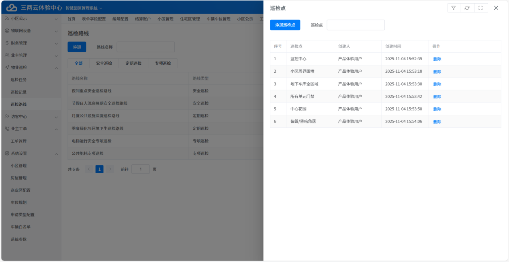
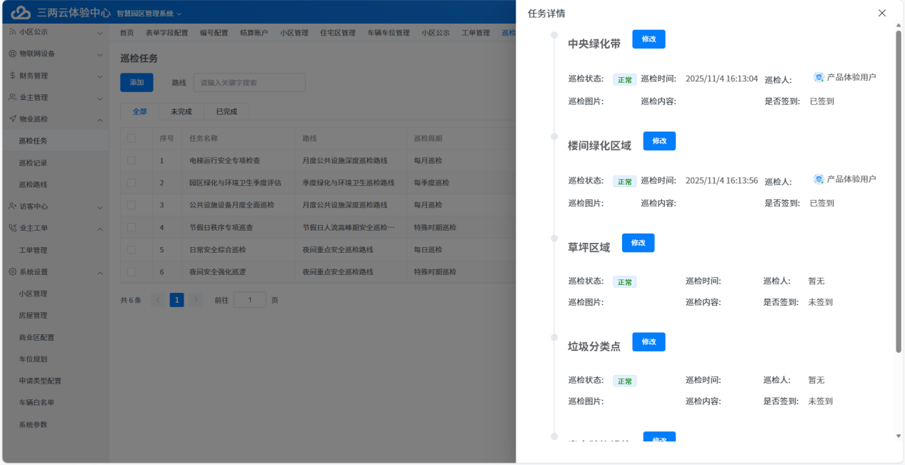

- 访客与门禁管理：登记访客信息，按车牌号、来访时间筛选查询，联动道闸系统实现精准放行，保障园区安全。

### 3.财务管理
- 费用收缴管理：自动生成水电、物业、停车等费用账单，支持费率自定义配置，跟踪缴费状态，实现便捷催缴。
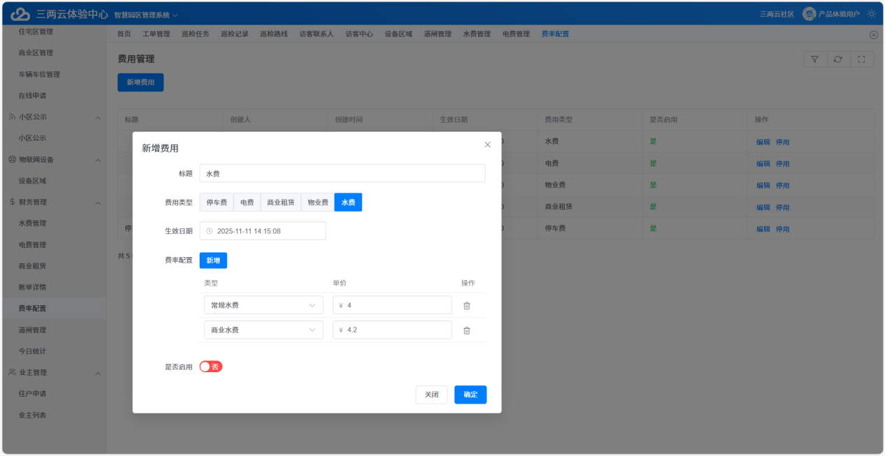
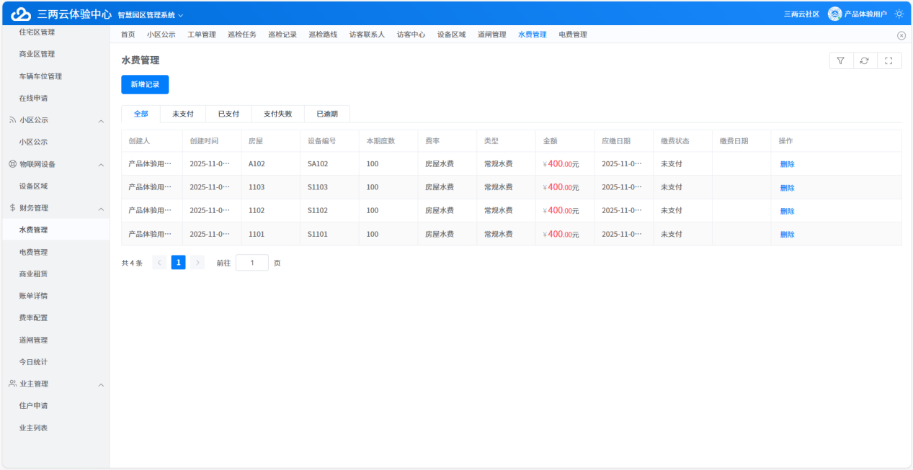
- 商业租赁管理：管控商铺租赁全流程，记录租赁周期、租金金额、特殊约定，实现租赁状态可视化与数据统计。
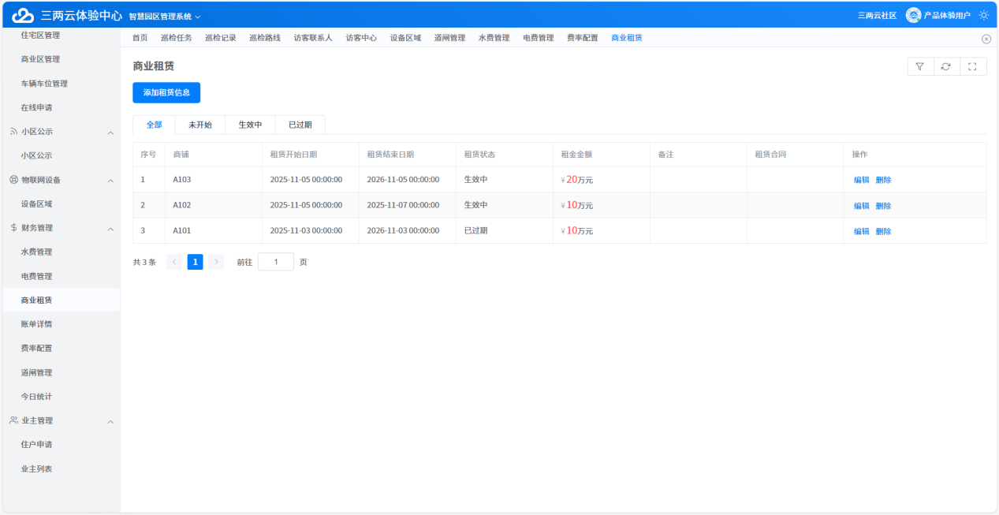

### 4.物联网与设备
- 设备区域与状态管理：规范设备归属区域，实时监控电梯、摄像头、水电表等设备的运行状态。
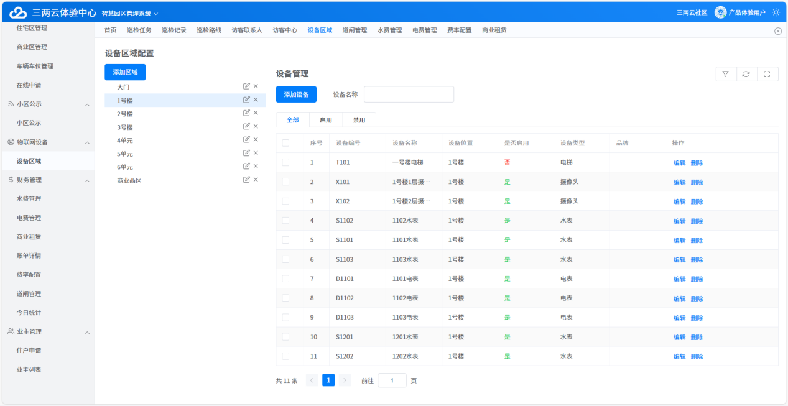
- 道闸系统管理：登记道闸设备编号与 IP 地址，实现设备状态在线监控，联动车辆登记信息保障园区交通有序。
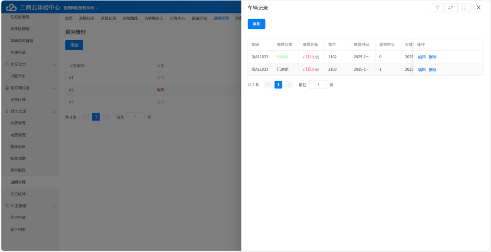

### 5.社区运营
- 信息发布与触达：分类发布社区通知、政策法规、活动预告等内容，确保信息精准触达业主，提升沟通效率。
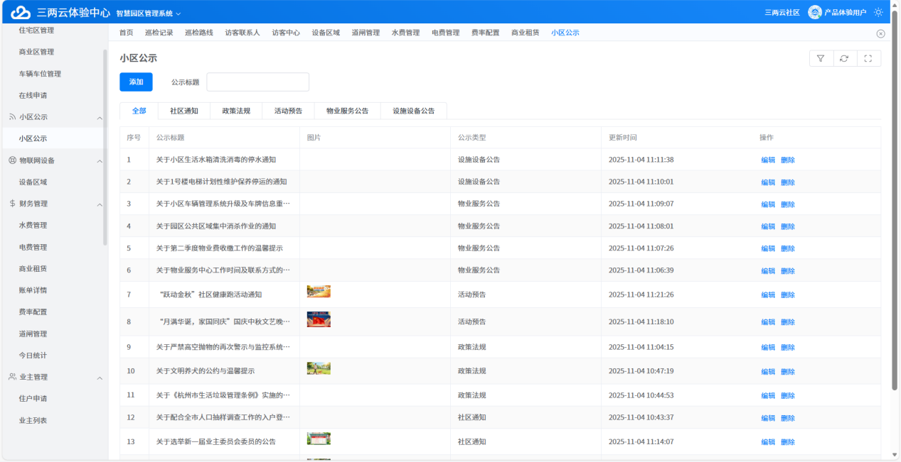

# 开源协议

[AGPL-3.0 License](https://www.gnu.org/licenses/gpl-3.0.html)

- 执行标准 AGPL 协议，无任何其他限制条款，可以自用和商用，但必须保留原知识产权

# 本地开发说明

- 本项目非传统 Spring boot 的项目，不适合个人学习使用。
- 项目中大量代码由低码工具生成，lowcode 目录代码不要强行改写会影响迭代升级。
- 为了提升业务对象对大模型的友好性，我们研发上禁止了 SQL 编程，所以项目不包含任何 SQL 语言，不要误认为代码不全，工程可以完整运行
- 低码引擎会自动创建表，自动适配不同类型数据库，不需要数据库初始化脚本

# 为什么本地源码打包后，程序体积变大

- 本地打包是标准 mvn 打包模式。公司内部研发平台，增加了编译优化逻辑，将 jar 包体积减少 50%以上，程序启动速度，运行性能也有明显提升。

## 源码目录结构

- house 目录是 Java 源码文件
- vue 目录是前端源码文件
- release 打包后的二进制文件与启动脚本，私有部署的话只需要看这个目录就行

## IDE 里工程启动说明

- 启动 java 工程，初次启动时系统会载入安装配置页面
- 在浏览器里进入地址：http://127.0.0.1:7036/ ，配置数据库连接参数
- 进入 vue 目录，npm install -d 命令安装前端依赖
- 然后执行 npm run start 启动前端工程，即可进入开发模式，前端工程如何进入程序调试模式
- 💡💡💡 初次启动会报数据库链接异常，但应用已经启动，在浏览器中配置完数据库信息后，重新启动即可进入开发

## 工程打包部署

- 前端工程开发完成后，执行 npm run dist 命令构建前端脚本
- 将前端工程 dist 目录中构建好的 app.js 文件进行 gzip 压缩 (文件名保持不变)
- 压缩后的 app.js 文件复制到 java 工程 src/resources/static/ 目录里
- 进入 java 工程目录，执行 mvn clean && mvn package -f ./pom.xml 生成 java 二进制文件
- 最终部署文件地址：house/target/house.jar

# 关注微信服务号，了解更多

- 
